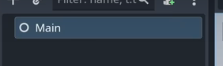
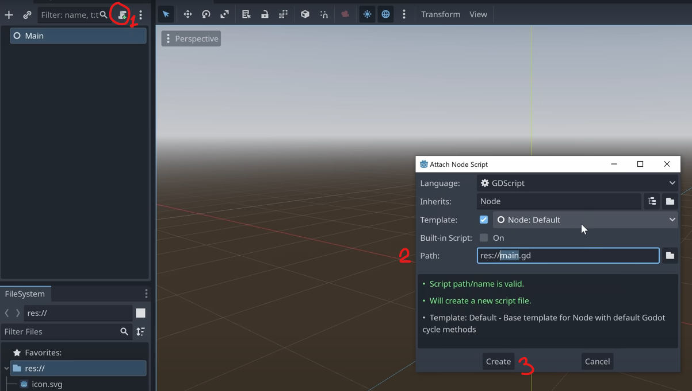
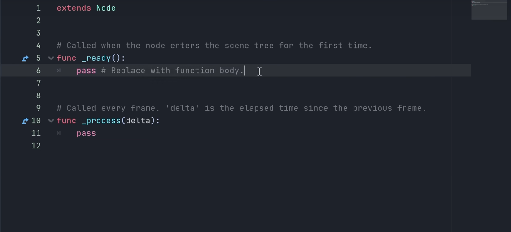

- [Modificando Nodos](Modificando%20Nodos.md)
- [Input](Input.md)
- [Variables](Variables.md)
- [If-statement](If-statement.md)
- [Comments](Comments.md)
- [Functions](Functions.md)
- [Números Aleatorios](Números%20Aleatorios.md)
- [Documentation](Documentation.md)
- [Arrays](Arrays.md)
- [Loops](Loops.md)
- [Dictionaries](Dictionaries.md)
- [Enums](Enums.md)
- [Match](Match.md)
- [Signals](Signals.md)
- [GET and SET](GET%20and%20SET.md)
- [Classes](Classes.md)
- [Inner Classes](Inner%20Classes.md)
- [Inheritance](Inheritance.md)
- [Composition](Composition.md)
- [Call down, signal up](Call%20down,%20signal%20up.md)
- [Styles](Styles.md)
Godot es un motor gráfico que funciona con nodos

Para crear un script se debe dar en el scroll pequeño con el singo + verde y luego hacerle un attach


Para mostrar cosas en la consola podemos hacer uso de la función
```python
# All this code is written on GDScipt but show as python for highlighting
func _ready():
	print("Hello World!")
```
